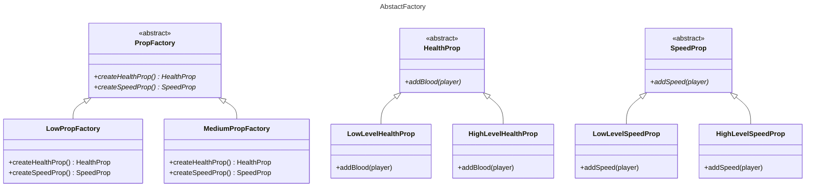
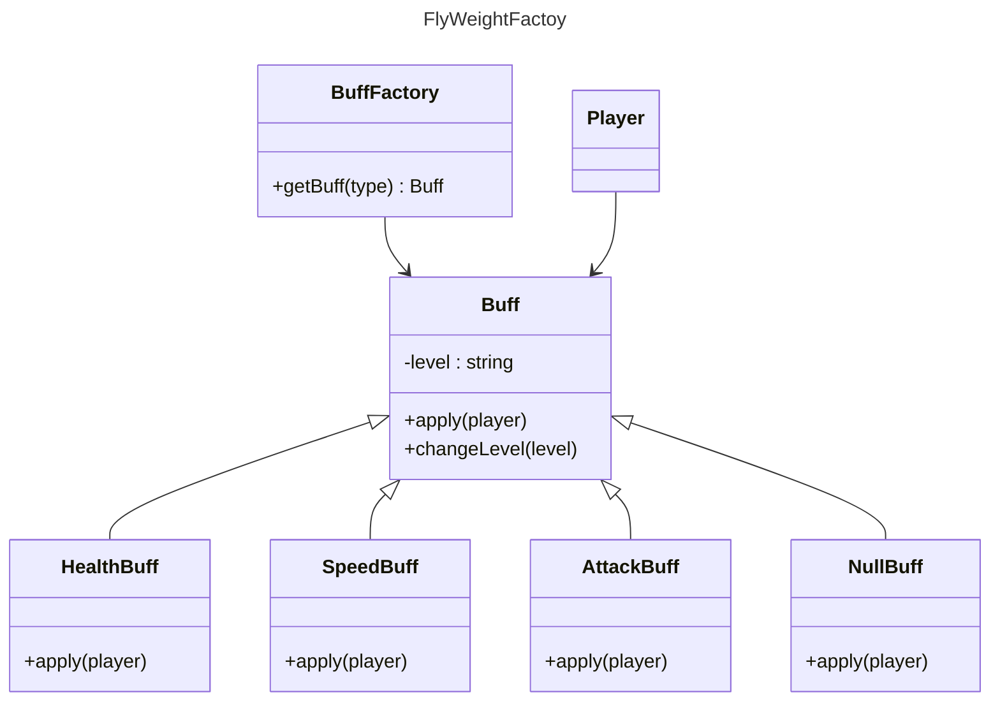
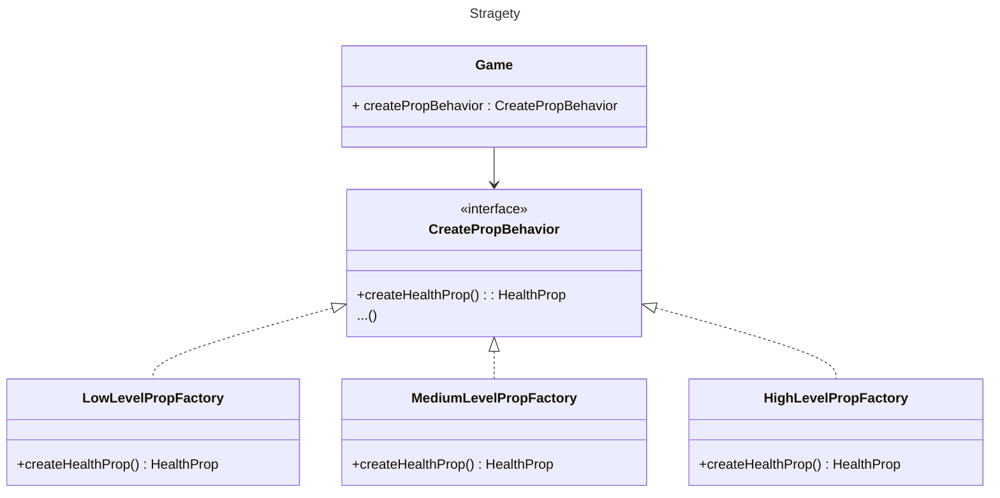
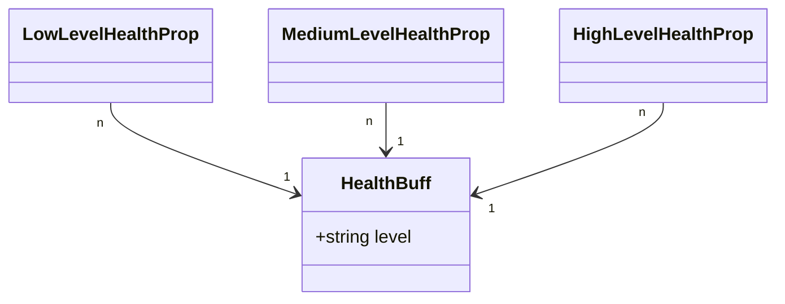
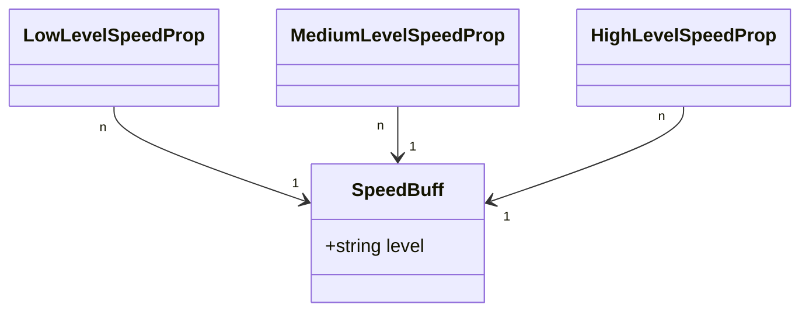
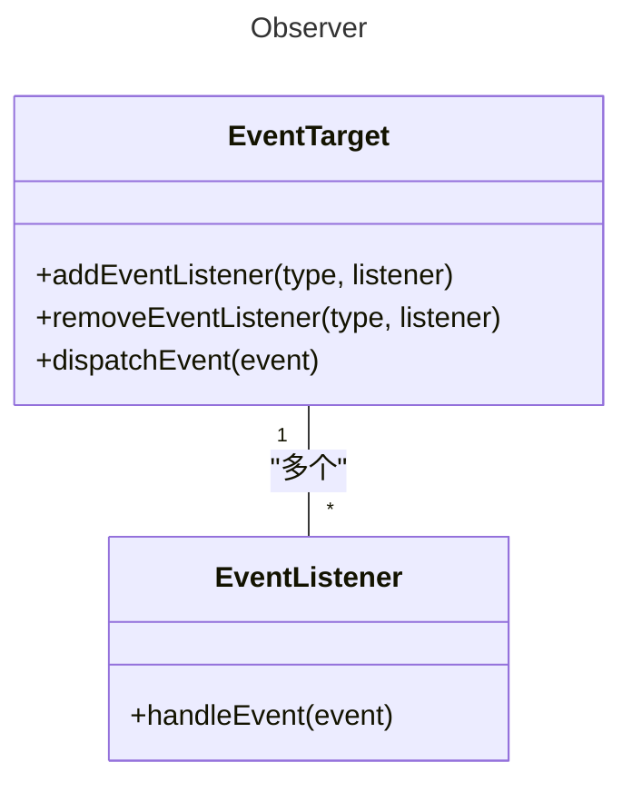

```mermaid
---
    title: AbstactFactory
---
classDiagram
    direction TB
    class PropFactory{
        <<abstract>>
        +createHealthProp()* HealthProp
        +createSpeedProp()* SpeedProp
    }
    class LowPropFactory{
        +createHealthProp() HealthProp
        +createSpeedProp() SpeedProp
    }
    class MediumPropFactory{
        +createHealthProp() HealthProp
        +createSpeedProp() SpeedProp
    }

    PropFactory <|-- LowPropFactory
    PropFactory <|-- MediumPropFactory


    class HealthProp{
        <<abstract>>
        +addBlood(player)*
    }

    class LowLevelHealthProp{
        +addBlood(player)
    }

    class HighLevelHealthProp{
        +addBlood(player)
    }

    class SpeedProp{
        <<abstract>>
        +addSpeed(player)*
    }

    HealthProp <|-- LowLevelHealthProp
    HealthProp <|-- HighLevelHealthProp

    class LowLevelSpeedProp{
        +addSpeed(player)
    }

    class HighLevelSpeedProp{
        +addSpeed(player)
    }

    SpeedProp <|-- LowLevelSpeedProp
    SpeedProp <|-- HighLevelSpeedProp
```

```mermaid
---
    title: FlyWeightFactoy
---
classDiagram
    class BuffFactory {
        +getBuff(type) Buff
    }

    class Buff {
        -level : string
        +apply(player)
        +changeLevel(level)
    }

    BuffFactory --> Buff
    Buff <|-- HealthBuff
    Buff <|-- SpeedBuff
    Buff <|-- AttackBuff
    Buff <|-- NullBuff
    Player --> Buff

    HealthBuff : +apply(player)
    SpeedBuff : +apply(player)
    AttackBuff : +apply(player)
    NullBuff : +apply(player)

```

```mermaid
---
    title: Stragety
---
classDiagram
    class Game{
        + createPropBehavior : CreatePropBehavior
    }
    Game  --> CreatePropBehavior

    class CreatePropBehavior{
        <<interface>>
        +createHealthProp(): HealthProp
        ...()
    }
    
    CreatePropBehavior <|.. LowLevelPropFactory
    CreatePropBehavior <|.. MediumLevelPropFactory
    CreatePropBehavior <|.. HighLevelPropFactory

    LowLevelPropFactory: +createHealthProp() HealthProp
    MediumLevelPropFactory: +createHealthProp() HealthProp
    HighLevelPropFactory: +createHealthProp()  HealthProp
```

```mermaid
classDiagram
    LowLevelHealthProp "n" --> "1" HealthBuff
    MediumLevelHealthProp "n" --> "1" HealthBuff
    HighLevelHealthProp "n" --> "1" HealthBuff
    HealthBuff : +string level
```

```mermaid
classDiagram
    LowLevelSpeedProp "n" --> "1" SpeedBuff
    MediumLevelSpeedProp "n" --> "1" SpeedBuff
    HighLevelSpeedProp "n" --> "1" SpeedBuff
    SpeedBuff : +string level
```

```mermaid
---
    title: Observer
---
classDiagram
    class EventTarget {
        +addEventListener(type, listener)
        +removeEventListener(type, listener)
        +dispatchEvent(event)
    }

    class EventListener {
        +handleEvent(event)
    }

    EventTarget "1"--"*" EventListener : "多个"
```